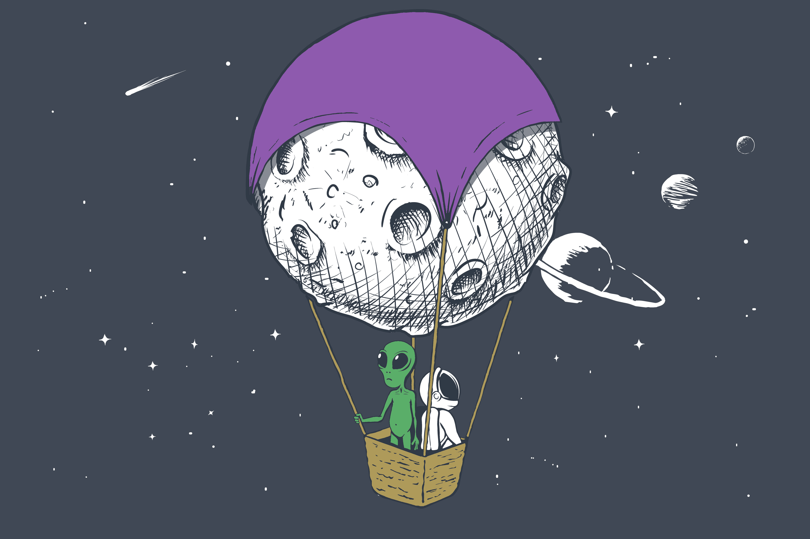

# 👽 NFT COLLECTION

### Introduction

We took a concept you like and added a layer of fun. Join this new DEFI adventure in the role of an alien that can give you access to various bonuses when trading.

Floating around in the universe is fun but having a fast alien spaceship is even more fun and will help you reach your goal faster. The ship will give your alien positions some advantage like discount on fees, air drops and who know what else. Take a look at the spaceship section to learn more.

Liquidity Providers can collect Planets from the pool that uses one single NFT as proof of participation. Your aliens ships bonuses apply.


Alien are highly addicted to spice. Do not leave spice, ship or aliens unattended.

