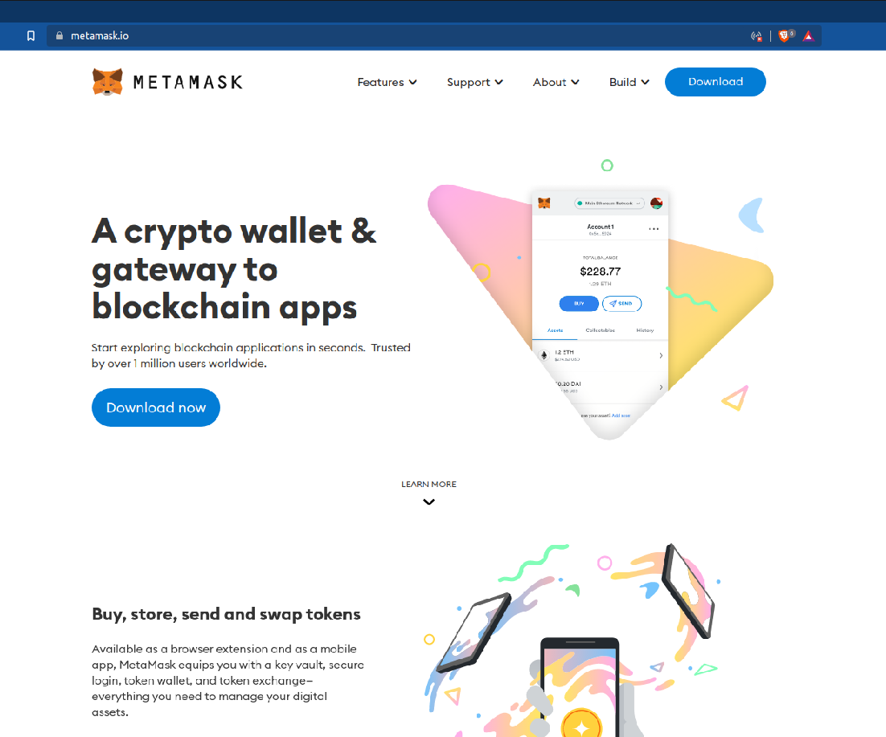
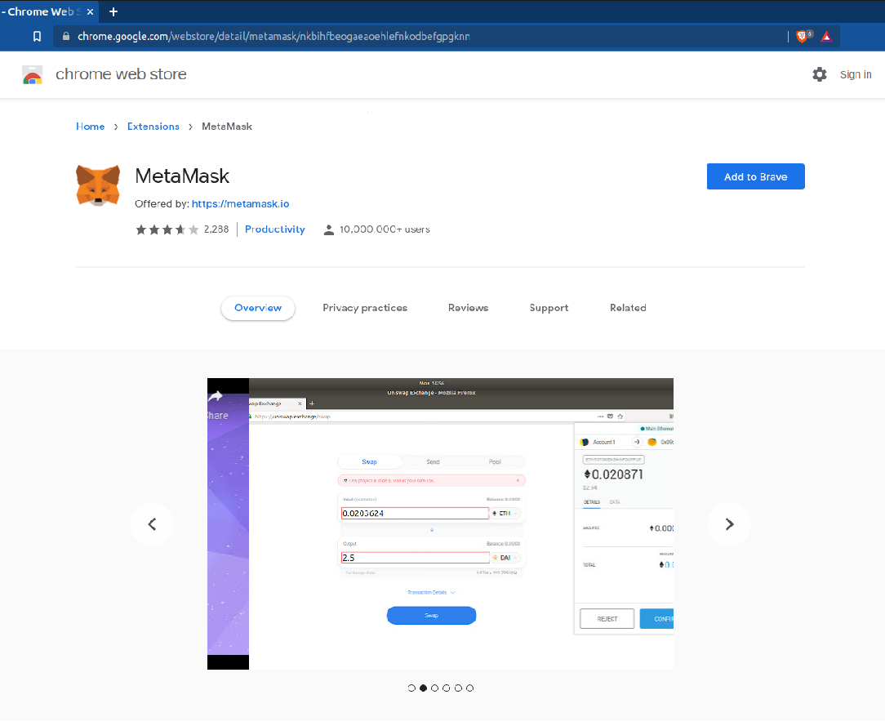
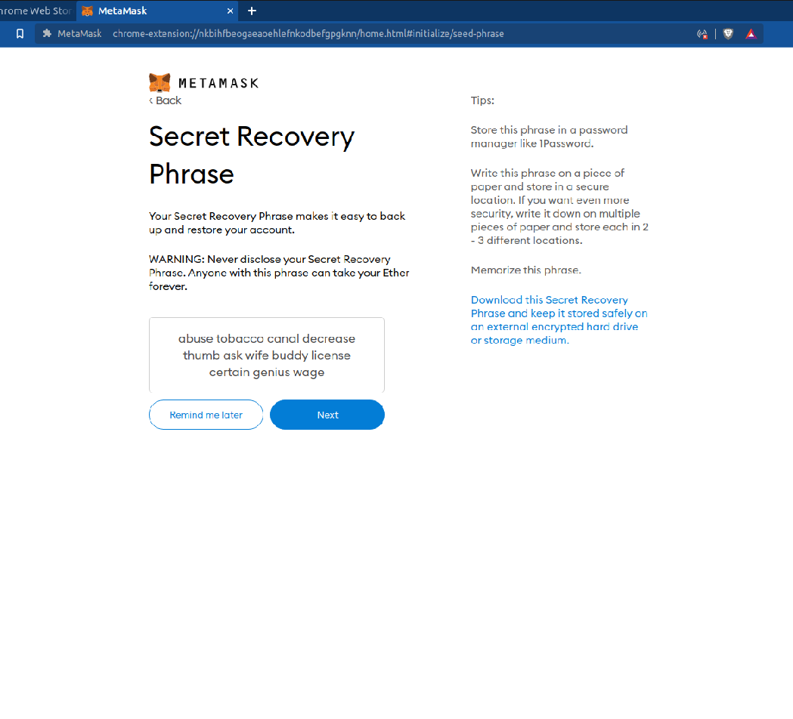

# Everything An Alien Needs To Know About Metamask

## Install Metamask

Go to the Metamask website and download the Metamask browser extension for you Operating System.


Link to metamask.io


### Step 2: Pick Your Browser

Pick your Browser that you want to add Metamask to.

### Step 3: Add Your Browser

Click "Add to browser".

### Step 4: Add the Extension

Click "Add extension." 

### Step 5: Get Started 

Click "Get Started." 

### Step 6: Create Wallet

Click "Create a wallet." 

### Step 7: Agree

Click on "I Agree." 

### Step 8: Create Your Password

Create your password and accept the terms. 

### Step 9: Watch Video

Watch the video for information on your seed phrase. 

### Step 10: Reveal Seed Phrase

Click "reveal seed phrase. 

### Step 11: Copy Seed Phrase and Keep It Safe.
Copy you seed phrase somewhere safe. 

### Step 12: Confirm Seed Phrase

Confirm your seed phrase. 

Upon completion you will be automatically put into Account 1 of your new Metamask Wallet . 

Congratulations! At this point Metamask is already connected to the Ethereum Mainnet by default. We will show you how to add the Polygon Network and the Binance Smart Chain to your Metamask wallet in the next section.

IMPORTANT - Your 12 word seed phase is the only thing that allows you to secure your wallet. You should keep it safe and in a place that is hidden. If you ever need to do a PC reset or you want to move your wallet to another machine, you will need you 12 word seed phrase to do this.
