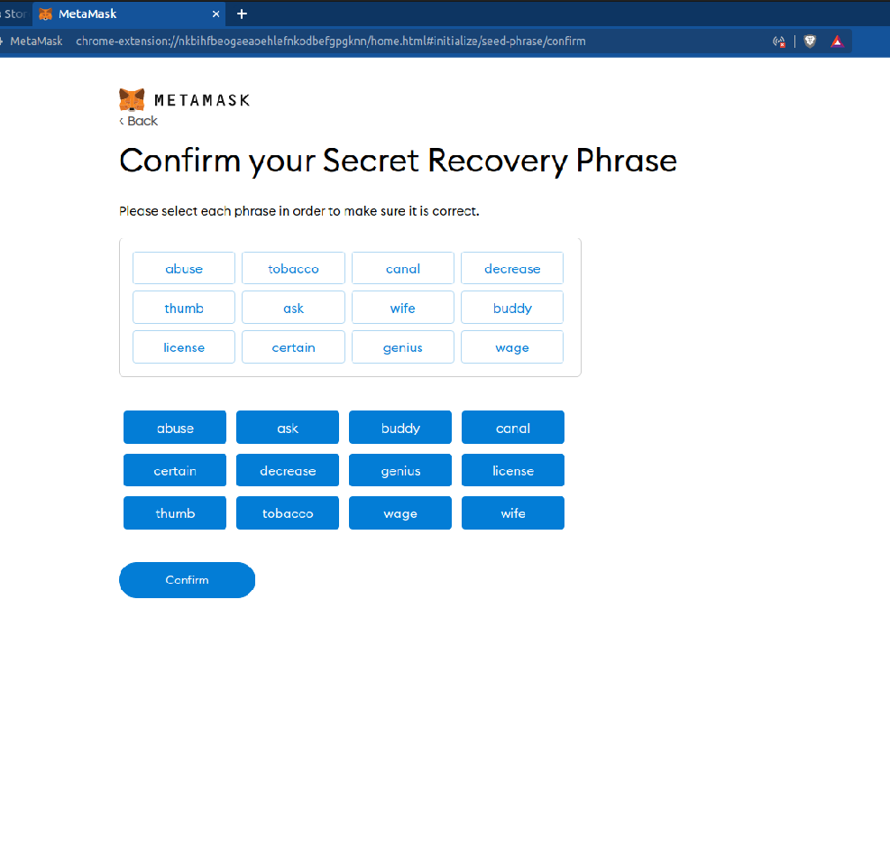

# Metamask

## Install Metamask

Go to the Metamask website and download the Metamask browser extension for you Operating System.


Never share your seed phrase to no one. Don't copy and paste it in a file. Write it down, double check it, store it somewhere safe.



Link to metamask.io


### Select your device type

Select the device your using. On your PC Metamask is an extension to your browser. On mobiles device, The browser is an an extension to the Metamask application.

### Add Metamask to your browser.

Click "Add to browser".

### Approve the extension

Click "Add extension."

### Get Started

Click "Get Started."

### Importing or creating a wallet.

Click "Create a wallet."

### Agree

Click on "I Agree."

### Your Password

Create your password and accept the terms.

### Step 9: Watch Video

Watch the video for information on your seed phrase.

### Reveal Seed Phrase

Click "reveal seed phrase.

### Copy Seed Phrase and Keep It Safe.

Copy your seed phrase somewhere safe.

### Confirm Seed Phrase

Confirm your seed phrase.

Upon completion you will be automatically put into Account 1 of your new Metamask Wallet .

Congratulations! At this point Metamask is already connected to the Ethereum Mainnet by default.

IMPORTANT - Your 12 word seed phase is the only thing that allows you to secure your wallet. You should keep it safe and in a place that is hidden. If you ever need to do a PC reset or you want to move your wallet to another machine, you will need your 12 word seed phrase to do this.
