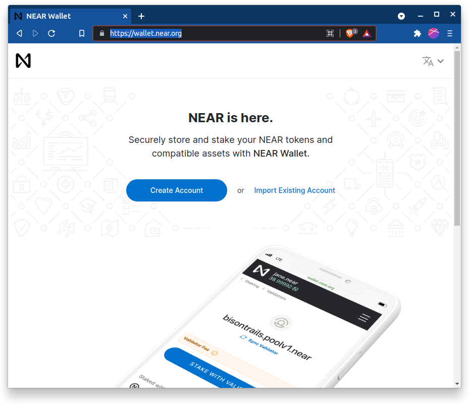
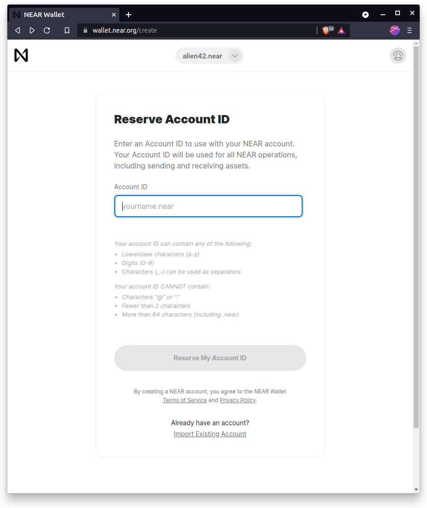
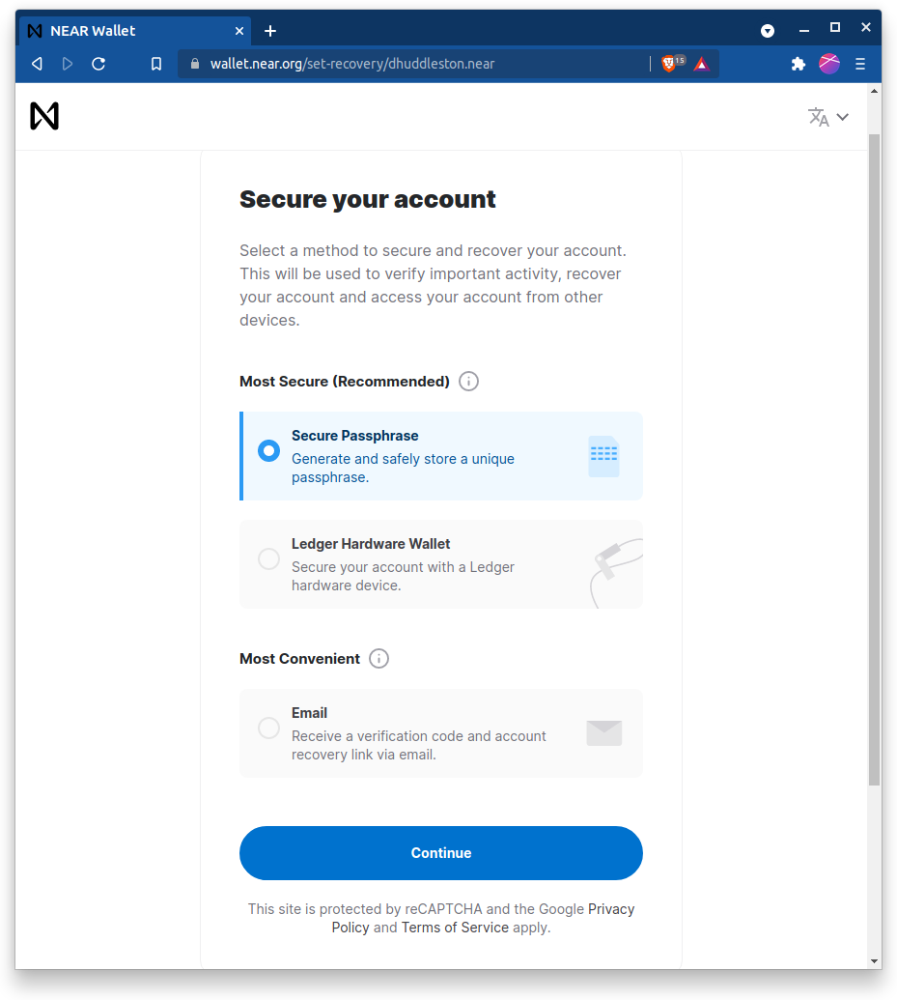
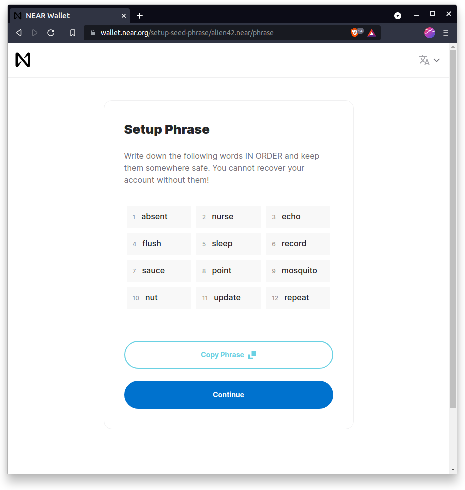
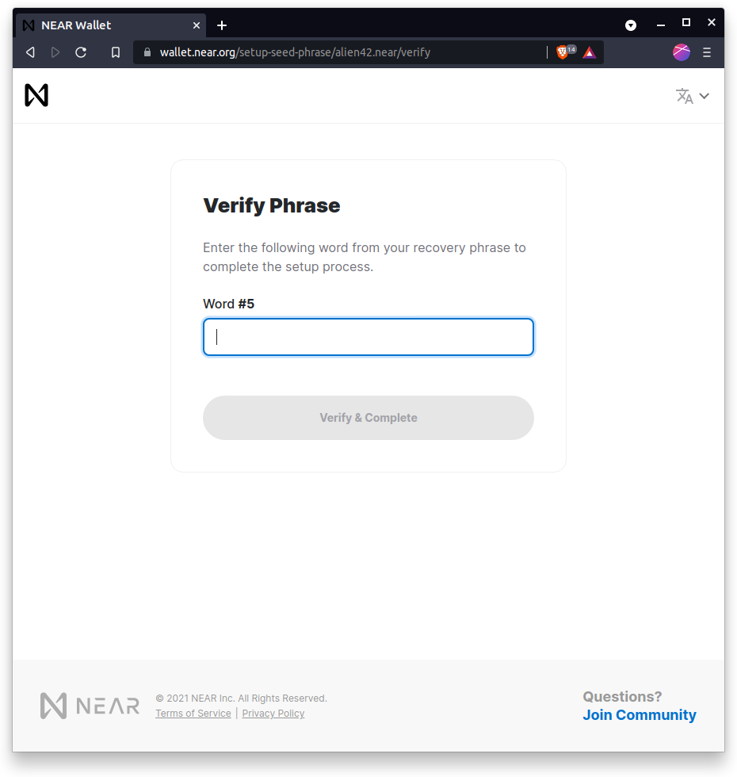
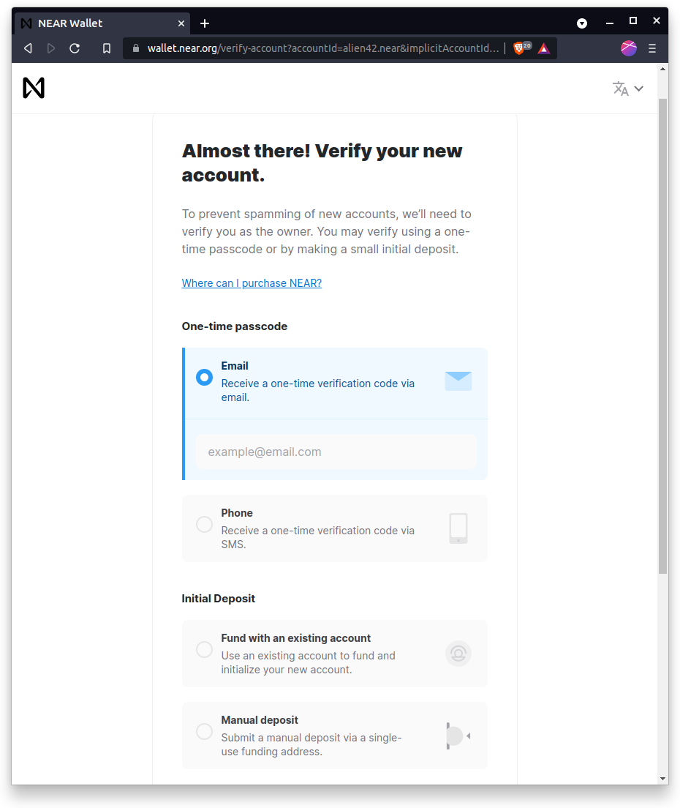
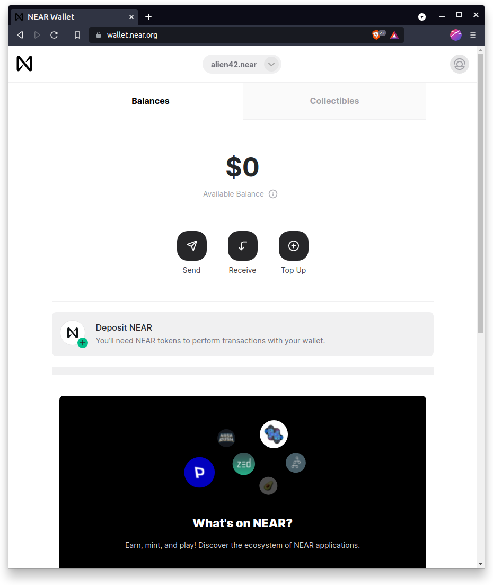

# NEAR



## NEAR Wallet Account Setup

### First go to https://wallet.near.org to get started.

### Then you will need to create a username.

### You will choose one of the following methods to secure  the account. The passphrase is a secure method and popular among aliens so we will go with that one.

### You will need to copy you your seed phrase and keep it somewhere safe.

### After this you will verify your seed phrase.

### Next you will verify your ownership. Email is a good selection here.

### After verifying your email or mobile device, you will be sent to your NEAR wallet.

